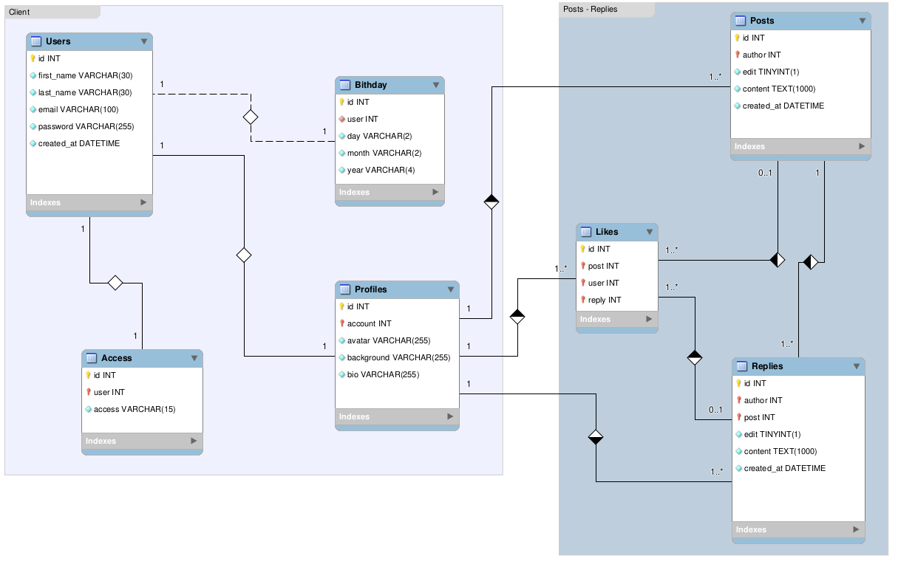

# FastAPI


O projeto será modelado no contexto de Rede Social, afim de utilizar CRUD nas rotas e diferentes tipos de relacionamentos do banco de dados.

> - Para construir o projeto isolei cada aplicação em seu próprio ecosistema e embiente virtual.

> - [**Link do Deploy do projeto Coffee-Break** -> "Rede social minimalista" que consome essa api! \o/](https://coffee-break-network.herokuapp.com/)

- [**Tarefas**](tasks.md)

- [**Testes**](tests.md)

## Resumo

- [FastAPI](#fastapi)
  - [Resumo](#resumo)
  - [Funcionalidades](#funcionalidades)
    - [Usuários](#usuários)
    - [Segurança](#segurança)
    - [Postagens](#postagens)
    - [Comentários](#comentários)
  - [Requisitos](#requisitos)
  - [Ambiente](#ambiente)
  - [Iniciar o servidor](#iniciar-o-servidor)
  - [Testes](#testes)
  - [Estrutura](#estrutura)
  - [Modelagem do banco de dados](#modelagem-do-banco-de-dados)

---

## Funcionalidades

### Usuários

- [x] Registro
- [x] Listagem de perfil
  - [x] Todos
  - [x] Por @username
- [x] Atualizar dados
- [x] Acessar os dados da conta
- [x] Deletar conta

### Segurança

- [x] Autenticação
  - [x] Access token
  - [x] Refresh Token
- [x] Recuperar senha
  - [x] Email com link e tokenJwt
- [x] Atualizar senha

### Postagens

- [x] Criação
- [x] Edição
- [x] Remoção
- [x] Listar por id
- [x] Listagem de posts
- [x] Listagem por usuário
- [ ] Listagem de posts seguidos (timeline)
- [x] Curtidas em posts

### Comentários

- [x] Criação
- [x] Edição
- [x] Remoção
- [x] Listar por id
- [x] Listagem por post
- [x] Curtidas em comentários

## Requisitos

- Git
- Python 3.10
- virtualenv ou semelhante
- Um editor de códigos como VSCode, Sublime, Vim, Pycharm ...

## Ambiente

Crie o ambiente virtual desta aplicação

```console
virtualenv .venv
```

Ative o ambiente

```console
# Linux Bash
source .venv/bin/activate
# Windows Power Shell
./.venv/bin/activate.ps1
```

Instale as dependências de desenvolvimento e teste

```console
pip install -r requirements-dev.txt
```

## Iniciar o servidor

Inicie o localhost

```console
uvicorn app:app --reload --factory
```

Acesse o docs de endpoints do Fastapi em:

<http://127.0.0.1:8000/docs#/> ou <http://127.0.0.1:8000/redoc/>

## Testes

```console
cd tests
pytest
```

## Estrutura

```console
.
├── app
│   ├── controllers
│   │   ├── auth_controller.py
│   │   ├── __init__.py
│   │   ├── password_controller.py
│   │   ├── post_controller.py
│   │   ├── reply_controller.py
│   │   └── user_controller.py
│   ├── helpers
│   │   ├── http_exceptions.py
│   │   ├── http_protocols.py
│   │   └── __init__.py
│   ├── middlewares
│   │   └── __init__.py
│   ├── models
│   │   ├── access.py
│   │   ├── birthday.py
│   │   ├── __init__.py
│   │   ├── like.py
│   │   ├── post.py
│   │   ├── profile.py
│   │   ├── reply.py
│   │   └── user.py
│   ├── repositories
│   │   ├── backend.py
│   │   └── __init__.py
│   ├── requests
│   │   ├── __init__.py
│   │   ├── post_requests.py
│   │   └── user_requests.py
│   ├── responses
│   │   ├── __init__.py
│   │   ├── post_responses.py
│   │   ├── token_responses.py
│   │   └── user_responses.py
│   ├── routes
│   │   ├── auth.py
│   │   ├── password.py
│   │   ├── post.py
│   │   ├── reply.py
│   │   └── user.py
│   ├── security
│   │   ├── recovery.py
│   │   ├── session.py
│   │   └── token.py
│   ├── services
│   │   ├── database.py
│   │   └── storage.py
│   ├── __init__.py
│   └── routers.py
├── docs
│   ├── endpoints.png
│   ├── MBD.png
│   ├── README.md
│   ├── tasks.md
│   └── tests.md
├── tests
│   ├── models
│   │   ├── __init__.py
│   │   ├── test_password.py
│   │   ├── test_post.py
│   │   ├── test_reply.py
│   │   ├── test_token.py
│   │   └── test_user.py
│   ├── routes
│   │   ├── __init__.py
│   │   ├── test_auth.py
│   │   ├── test_password.py
│   │   ├── test_post.py
│   │   ├── test_reply.py
│   │   └── test_user.py
│   ├── unity
│   │   ├── __init__.py
│   │   └── test_token_jwt.py
│   ├── utils
│   │   ├── client.py
│   │   └── post.py
│   ├── conftest.py
│   ├── __init__.py
│   └── pytest.ini
├── LICENSE
├── Procfile
├── requirements-dev.txt
├── requirements.txt
└── runtime.txt

17 directories, 68 files
```

## Modelagem do banco de dados


