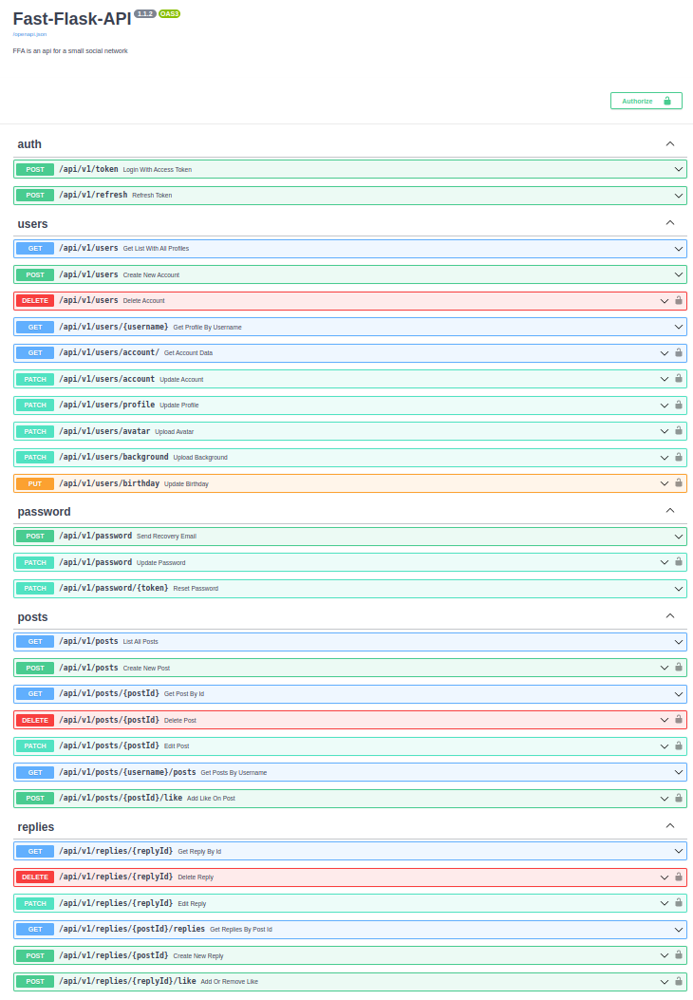

# FastAPI





O projeto será modelado no contexto de um Blog, afim de utilizar CRUD nas rotas e diferentes tipos de relacionamentos do banco de dados.

> - Para construir o projeto isolei cada aplicação em seu próprio ecosistema e embiente virtual. 


- [**Tarefas**](tasks.md)

- [**Testes**](tests.md)


- [Testes no Postman](postman.png)

- Collections para importar os testes pro Postman (.json)
  -  [deploy](Fast-Flask-API%20-%20-%20Fast-Deploy.postman_collection.json)
  -  [localhost](Fast-Flask-API%20-%20-%20LocalHost.postman_collection.json)


## Resumo 
- [FastAPI](#fastapi)
  - [Resumo](#resumo)
  - [Funcionalidades](#funcionalidades)
    - [Usuários](#usuários)
    - [Postagens](#postagens)
  - [Requisitos](#requisitos)
  - [Ambiente](#ambiente)
  - [Iniciar o servidor](#iniciar-o-servidor)
  - [Testes](#testes)
  - [Estrutura](#estrutura)
---

## Funcionalidades

### Usuários

- [x] Registro de novos usuários
- [x] Autenticação de usuários
- [x] Atualizar dados
- [x] Atualizar senha
- [ ] Recuperar senha
- [x] Pegar os dados da conta
- [x] Listagem de usuários
- [x] Listagem de usuário por username
- [x] Deletar conta

### Postagens

- [x] Criação de novo post
- [x] Edição de post
- [x] Remoção de post
- [x] Listagem de posts
- [x] Listagem de post por id
- [x] Listagem de posts por usuário
- [ ] Listagem de posts seguidos (timeline)
- [x] Likes em postagens
- [ ] Postagem pode ser resposta a outra postagem


## Requisitos

- Git
- Python 3.10
- virtualenv ou semelhante
- Um editor de códigos como VSCode, Sublime, Vim, Pycharm ...


## Ambiente


Crie o ambiente virtual desta aplicação

```console
virtualenv .venv
```

Ative o ambiente 

```console
# Linux Bash
source .venv/bin/activate
# Windows Power Shell
./.venv/bin/activate.ps1
```

Instale as dependências de desenvolvimento e teste

```console
pip install -r requirements-dev.txt
```

## Iniciar o servidor

Inicie o localhost


```console
uvicorn app:app --reload --factory
```

Acesse o docs de endpoints do Fastapi em:

http://127.0.0.1:8000/docs#/ ou http://127.0.0.1:8000/redoc/


## Testes

```console
cd tests
pytest
```

## Estrutura

```console
.
├── app
│   ├── controllers
│   │   ├── auth.py
│   │   ├── decorators
│   │   │   ├── auth_controller.py
│   │   │   ├── post_controller.py
│   │   │   └── user_controller.py
│   │   ├── post.py
│   │   └── user.py
│   ├── __init__.py
│   ├── models
│   │   ├── post
│   │   │   ├── __init__.py
│   │   │   ├── post.py
│   │   │   ├── request.py
│   │   │   └── response.py
│   │   ├── token
│   │   │   ├── __init__.py
│   │   │   └── token_model.py
│   │   └── user
│   │       ├── __init__.py
│   │       ├── request.py
│   │       ├── response.py
│   │       └── user.py
│   ├── routes.py
│   └── utils
│       ├── login_required.py
│       └── token_jwt.py
├── docs
│   ├── endpoints.png
│   ├── Fast-Flask-API - - Fast-Deploy.postman_collection.json
│   ├── Fast-Flask-API - - LocalHost.postman_collection.json
│   ├── postman.png
│   ├── README.md
│   ├── tasks.md
│   └── tests.md
├── LICENSE
├── Procfile
├── requirements-dev.txt
├── requirements.txt
├── runtime.txt
├── setup.py
└── tests
    ├── conftest.py
    ├── __init__.py
    ├── models
    │   ├── __init__.py
    │   ├── test_post.py
    │   └── test_user.py
    ├── pytest.ini
    ├── routes
    │   ├── __init__.py
    │   ├── test_auth.py
    │   ├── test_post.py
    │   └── test_user.py
    ├── unity
    │   ├── __init__.py
    │   └── test_token_jwt.py
    └── utils
        ├── post.py
        ├── token.py
        └── user.py

14 directories, 48 files
```