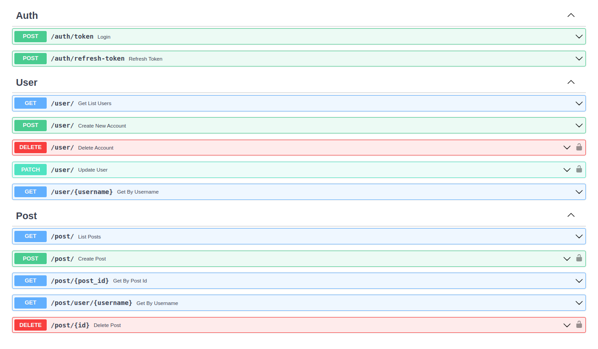

# FastAPI

Aplicação WEB - API usando FastAPI

> - Para construir o projeto isolei cada aplicação em seu próprio ecosistema e embiente virtual. 
> - Ambos possuem a mesma estrutura e finalidade, porém aplicadas em Frameworks diferentes.

---
## Resumo 
- [FastAPI](#fastapi)
  - [Resumo](#resumo)
  - [Requisitos](#requisitos)
  - [Ambiente](#ambiente)
  - [Funcionalidades](#funcionalidades)
    - [Usuários](#usuários)
    - [Postagens](#postagens)
  - [Estrutura](#estrutura)
  - [O Projeto](#o-projeto)
  - [Rodar os Testes](#rodar-os-testes)
  - [Endpoints](#endpoints)
---

## Requisitos

- Git
- Python 3.10
- virtualenv
- Um editor de códigos como VSCode, Sublime, Vim, Pycharm, Micro...


## Ambiente

Acesse a pasta fastapi no terminal

```console
cd fastapi/
```

Crie o ambiente virtual desta aplicação

```console
virtualenv .venv
```

Ative o ambiente 

```console
# Linux Bash
source .venv/bin/activate
# Windows Power Shell
./.venv/bin/activate.ps1
```

Instale as dependências

```console
pip install -r requirements.txt
# Teste
pip install -r requirements-test.txt
```


## Funcionalidades

### Usuários

- Registro de novos usuários
- Autenticação de usuários

### Postagens

- Criação de novo post
- Edição de post
- Remoção de post
- Listagem de posts geral (home)
- Listagem de posts seguidos (timeline)
- Likes em postagens
- Postagem pode ser resposta a outra postagem

## Estrutura

```console
.
├── app
│   ├── controllers
│   │   ├── decorators
│   │   │   └── post_user.py
│   │   └── user_controller.py
│   ├── __init__.py
│   ├── models
│   │   ├── post
│   │   │   └── __init__.py
│   │   └── user
│   │       ├── __init__.py
│   │       ├── user.py
│   │       ├── user_request.py
│   │       └── user_response.py
│   ├── routes.py
│   └── utils
│       ├── login_required.py
│       └── token_jwt.py
├── docs
│   ├── README.md
│   └── tasks.md
├── requirements.txt
├── setup.py
└── tests
    ├── conftest.py
    ├── __init__.py
    ├── models
    │   ├── __init__.py
    │   └── test_user.py
    ├── routes
    │   ├── __init__.py
    │   └── test_user.py
    ├── unity
    │   ├── __init__.py
    │   └── test_token_jwt.py
    └── utils
        ├── token.py
        └── user.py

13 directories, 25 files
```


## O Projeto

O projeto será modelado no contexto de um Blog, afim de utilizar CRUD nas routes e diferentes tipos de Relacionamentos do banco de dados.

Inicie o localhost

```console
cd fastapi/
```

```console
uvicorn app:app --reload --factory
```

Acesse o docs de endpoints do Fastapi em:

http://127.0.0.1:8000/docs#/ ou http://127.0.0.1:8000/redoc/


## Rodar os Testes

```console
cd fastapi/tests
pytest
```

## Endpoints

